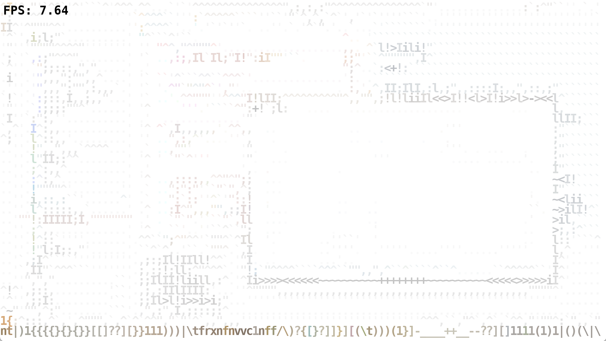
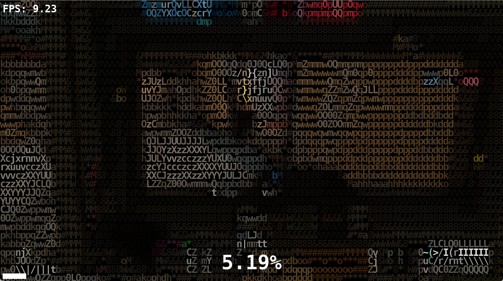
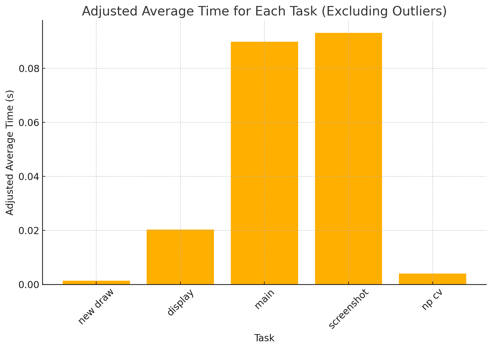
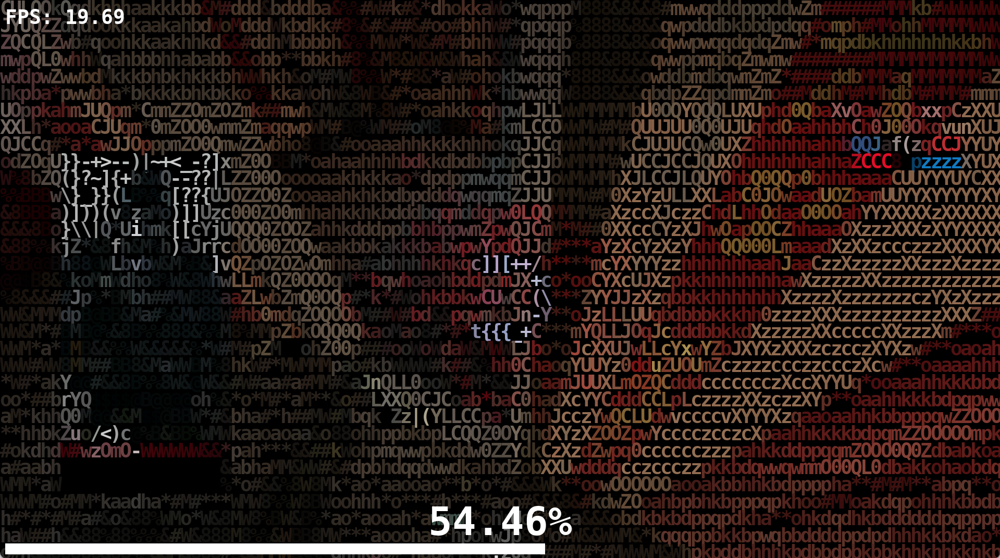
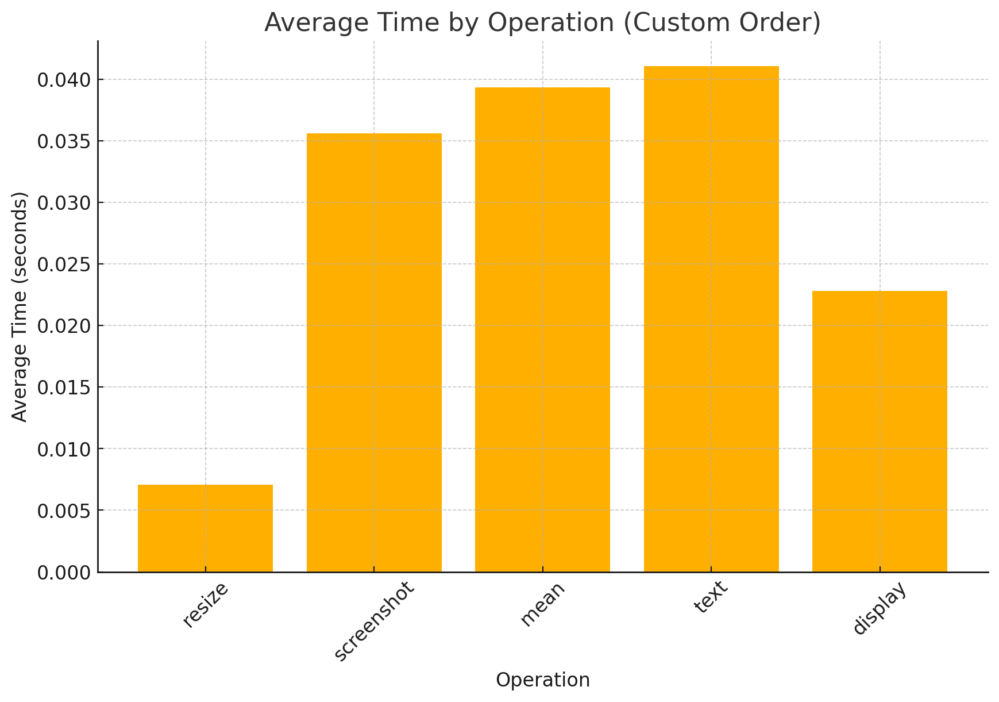
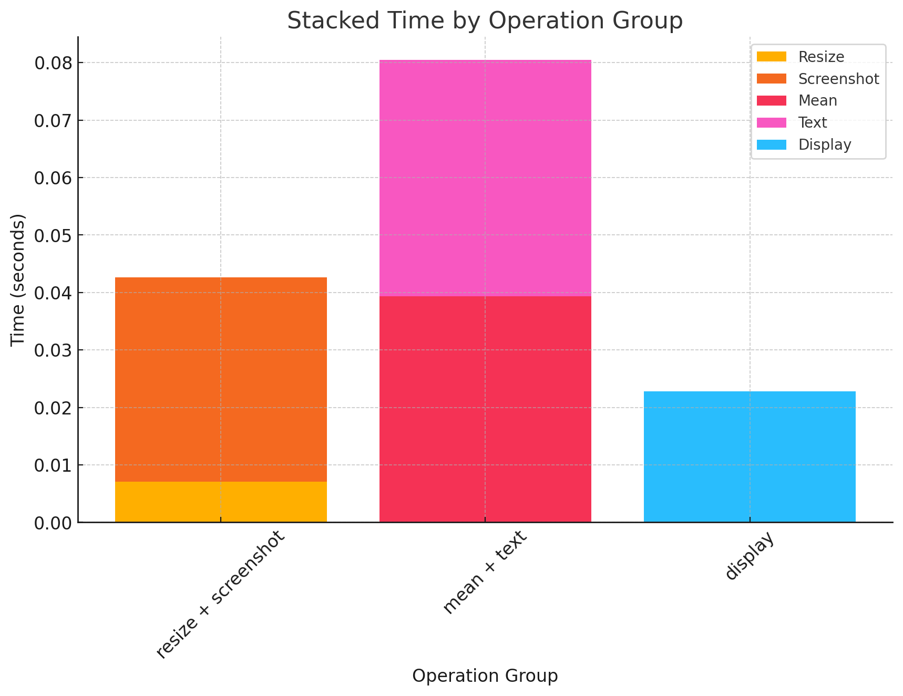
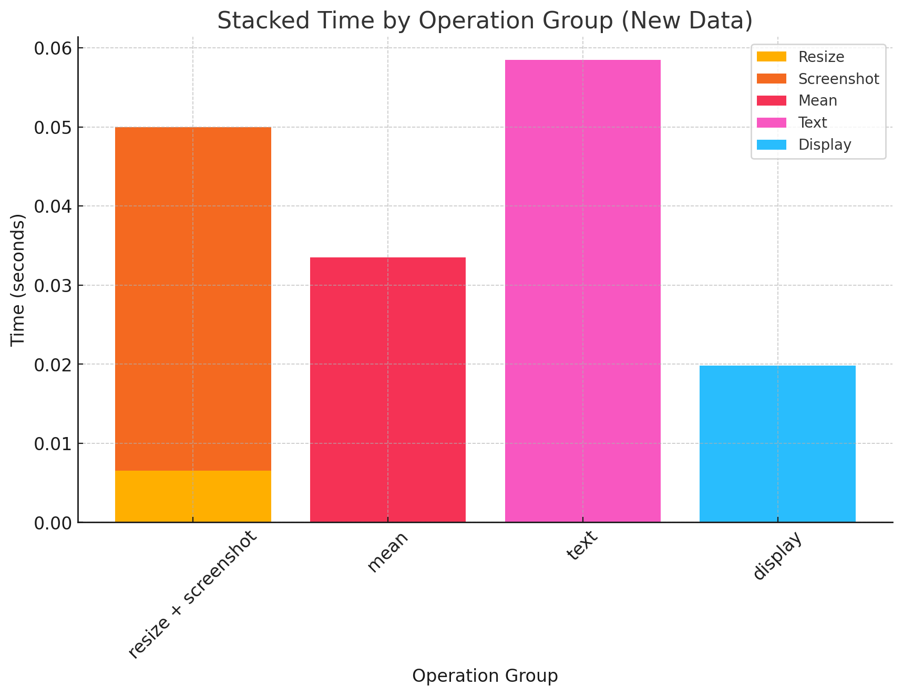

# [PYTHON] ASCII generator

- [\[PYTHON\] ASCII generator](#python-ascii-generator)
  - [Fork message](#fork-message)
  - [Introduction](#introduction)
  - [Changes](#changes)
  - [Rationale](#rationale)
    - [v1.0 Single-threaded performance](#v10-single-threaded-performance)
    - [v2.0 - Multi-threaded performance](#v20---multi-threaded-performance)
  - [Performance optimization](#performance-optimization)
    - [v1.1 - use `mss` instead of `pyautogui`](#v11---use-mss-instead-of-pyautogui)
    - [v3.0 - sliding window + `np.mean` + threading](#v30---sliding-window--npmean--threading)
    - [v3.0.1 - Split `screenshot` and `np` + minor optimizations](#v301---split-screenshot-and-np--minor-optimizations)
    - [v3.2 - Split `mean` and `text` + minor optimizations](#v32---split-mean-and-text--minor-optimizations)
  - [Next steps](#next-steps)

## Fork message

可播彩六

## Introduction

Original readme could be found at <https://github.com/vietnh1009/ASCII-generator>.

This repository is a fork of the original repository, featuring stream-to-stream conversion to ASCII art.

## Changes

- Implemented stream-to-stream conversion.
- Still supports file-to-file conversion.
- Optimized performance by splitting functions into separate threads.  
- Enhanced screen capture speed using `mss`.  
- Replaced nested loops with `np.mean` for improved efficiency.

## Rationale

### v1.0 Single-threaded performance

> Before threading, the typical fps is 7-8
> (4K, stream-to-stream, file-to-file not supported yet)

### v2.0 - Multi-threaded performance

Separating major functions into separate threads with a shared queue of size 1 significantly improves performance.

> After splitting the functions into separate threads, the typical fps is 9-10
> (4K, file-to-file)

> The nested loop version (`main`) takes approximately 0.09 seconds, serving as the program's bottleneck.
> Note that the `screenshot` time here is inaccurately measured, as it includes the wait time for putting the image into the queue while the `main` function continues to process the queue.

## Performance optimization

Overall performance (fps) is now determined by the most time-consuming thread, which we will split into separate threads.

### v1.1 - use `mss` instead of `pyautogui`

The screenshot time is reduced from `0.1` to `0.04` seconds, increasing fps by 5-10 at 4K resolution.

### v3.0 - sliding window + `np.mean` + threading

> After replacing the nested loops with `np.mean`, the typical fps is 17-20
> (4K, file-to-file)

### v3.0.1 - Split `screenshot` and `np` + minor optimizations

> The time distribution is now more balanced across each component.

### v3.2 - Split `mean` and `text` + minor optimizations

> Splitting `mean` and `text` decreases bottleneck time to 0.06 seconds, yielding a theoretical performance of 16.67 fps and an actual performance of 17-20 fps.
> (4K, file-to-file)

## Next steps

Move time-consuming functions to separate threads to further improve performance.

- [x] Split `mean` and `text` will increase little delay but improve performance.
