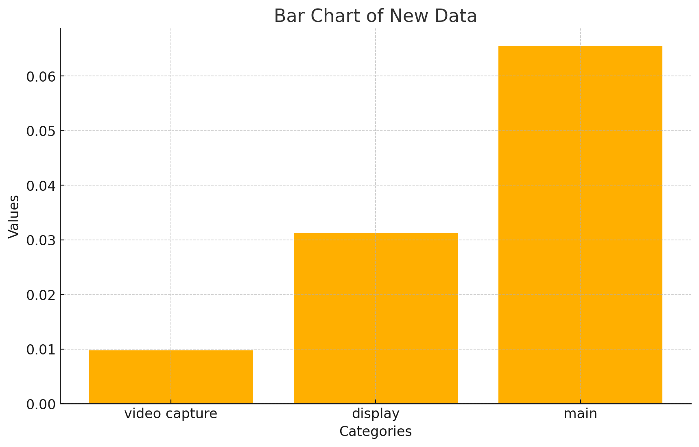

# [PYTHON] ASCII generator

## Fork message

可播彩六

## Introduction

Original readme could be found at <https://github.com/vietnh1009/ASCII-generator>.

This repository is a fork of the original repository, featuring stream-to-stream conversion to ASCII art.

## Changes

- Implemented stream-to-stream conversion.
- Still supports file-to-file conversion.
- Optimized performance by splitting functions into separate threads.  
- Enhanced screen capture speed using `mss`.  
- Replaced nested loops with `np.mean` for improved efficiency.

## Rationale

> Before threading, the typical fps is 7-8
> (4K, stream-to-stream, file-to-file not supported yet)

> After splitting the functions into separate threads, the typical fps is 9-10
> (4K, file-to-file)

> The nested loop version (`main`) takes approximately 0.09 seconds, serving as the program's bottleneck.
> Note that the `screenshot` time here is inaccurately measured, as it includes the wait time for putting the image into the queue while the `main` function continues to process the queue.

> After replacing the nested loops with `np.mean`, the typical fps is 17-20
> (4K, file-to-file)

> The time distribution is now more balanced across each component.
